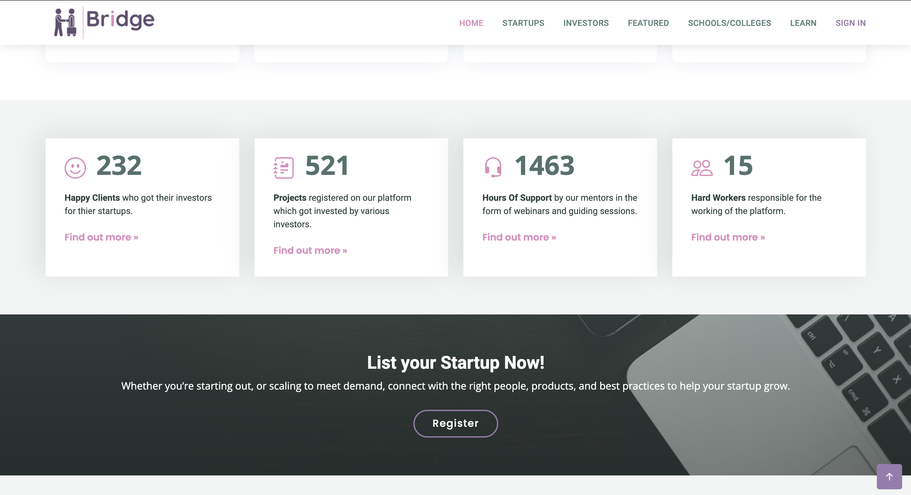
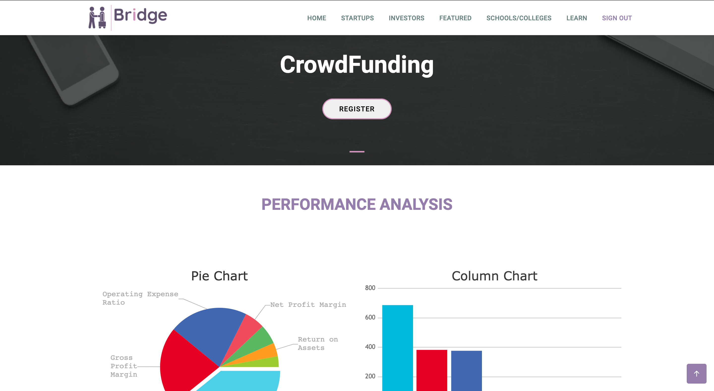

# Bridge - T_HACKS 4.0 Project (Team RgR)

### ..conneting ideas to investments..

Bridge for Startups is a platform to support thriving, diverse, and inclusive startup communities around the world. We connect startups with the right people, products, and best practices to help your startup grow.

## Table of Contents
1. [Features](#features)
2. [Technologies](#technologies)
3. [Installation](#installation)




## Video Demo
https://youtu.be/GmBa1pnKgDA


## Features
***

* A platform where startups, small or large, can list themselves and showcase their products.
* A marketplace where investors can find new and upcoming startups to invest in and follow their progress.
* A connecting medium between ideas and investments.
* A unique concept to list budding startups from schools and colleges.
* A special section for inspiring stories of startups growing from scratch.
* A learn section for amateurs as well as experts to learn and share knowledge.
* A platform to promote entrepenuership culture among school and college going students.

 
 

 
## Screenshots




## 


## Technologies
***
A list of technologies used within the project:
* HTML5
* CCS3
* JavaScript
* Express
* MongoDB
* NodeJs
* Mongoose
* PassportJS
* RazorPay API 

## Installation
***
A little intro about the installation. 
```
$ git clone https://github.com/garvit170/BRIDGE_THACK.git

```
```
$ npm install

```
```
$ node index.js 
or
$ npm start
```
